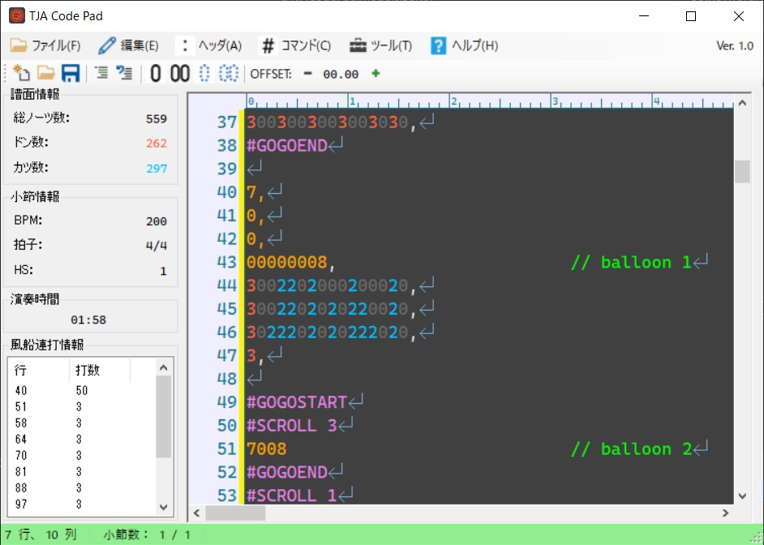

# TJA Code Pad

- TJAファイルを編集するためのエディタです．
- TJAEditorとほぼ同じ使用感で使うことができます．
  - 例）命令ショートカット（`#SCROLL`の場合）
    - TJAEditor: `Ctrl` + `s`
    - TJA Code Pad: `Alt` → `s` → `Enter`
- 加えて，新機能が多数ついています．

## 主な機能
- __コードの色分け機能__ - ヘッダや命令，ドンカツの色分けを行います．
- __ノーツ数カウント機能__ - 総ノーツ数，ドン数，カツ数をリアルタイムにカウントします．
- __演奏時間カウント機能__ - 譜面の演奏時間をリアルタイムでカウントします．
- __シミュレータ起動機能__ - 1キーでシミュレータを起動して，編集中の譜面を再生することができます．
- [NEW!!] __コメントアウト・コメント解除機能__ - カーソルで範囲選択してカンタンに一括コメントアウト，コメント解除を行うことができます．
- [NEW!!] __0埋め，00埋め，１文字詰め，２文字詰め機能__ - 1ボタンでカンタンに譜面を0埋めしたり，0埋めした行を文字詰めすることができます．
- [NEW!!] __OFFSET調整ボタン__ - ボタンクリックでカンタンにOFFSETを調整することができます．
- 
- [NEW!!] __小節情報表示機能__ - カーソル行の譜面が何小節目かとその小節BPM，拍子，HSを表示します．
- [NEW!!] __風船連打集計機能__ - リストビューに風船連打を記述した行と対応する連打数を表示します．リストビューの行をクリックすることでその行へジャンプします．
- [NEW!!] __テンプレート機能__ - 新規作成時の譜面の初期状態をテンプレートで指定することができます．
- [NEW!!] __外部ツール登録機能__ - 外部ツールを登録して，メニューから登録したツールをすぐに起動することができます（フォルダを登録することもできます）．
- [NEW!!] __リピート機能__ - 簡単に同じ行を指定回数繰り返すことができます．

## スクリーンショット

## 既知の不具合・仕様
- 譜面（'1000,'）の前にスペース等があると0埋め処理がうまくいかない
- 1ファイルで複数難易度の譜面を記述できない
- OFFSETヘッダの行にコメントを書くと，OFFSET編集機能を利用した際にコメントが消える

## ダウンロード
[releases](https://github.com/Mos305/TJACodePad-Releace/releases)からダウンロードできます．

## 更新履歴
### Ver. 1.0 - 2020/6/19